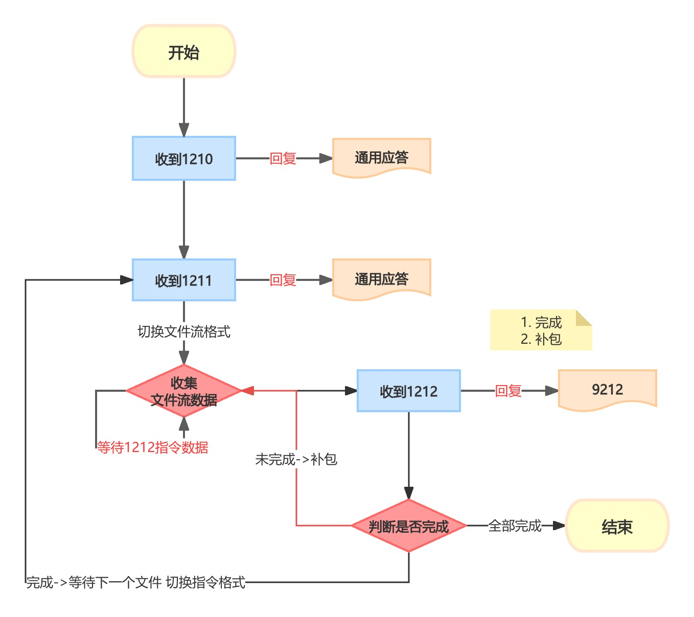

# 主动安全

## 报文解析流程


## 快速开始

``` go
package main

import (
	"github.com/cuteLittleDevil/go-jt808/attachment"
	"github.com/cuteLittleDevil/go-jt808/shared/consts"
	"log/slog"
	"os"
)

func init() {
	logger := slog.New(slog.NewJSONHandler(os.Stdout, &slog.HandlerOptions{
		AddSource:   true,
		Level:       slog.LevelDebug,
		ReplaceAttr: nil,
	}))
	slog.SetDefault(logger)
}

func main() {
	attach := attachment.New(
		attachment.WithNetwork("tcp"),
		attachment.WithHostPorts("0.0.0.0:10001"),
		attachment.WithActiveSafetyType(consts.ActiveSafetyJS), // 默认苏标 支持黑标 广东标 湖南标 四川标
		//attachment.WithFileEventerFunc(func() attachment.FileEventer {
		//	// 自定义文件处理 开始 结束 当前进度 补传 完成等事件
		//	// 默认新建文件夹（手机号）下保存文件
		//	return &meFileEvent{}
		//}),
	)
	go attach.Run()
}

```

## 本地文件上传参考
- [代码参考](../example/attachment/local/main.go)

``` txt
1 启动主动安全附件服务
2 自定义模拟器把dir目录下的文件都上传

```

## 苏标
- [代码参考](../example/attachment/su_biao/main.go)

``` txt
1 设备连接到808服务
2 自定义终端事件 检测到苏标告警后发送9208指令
3 设备开始上传文件 本地./file.log中显示进度

```


