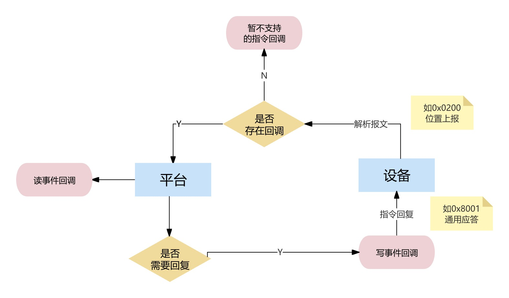
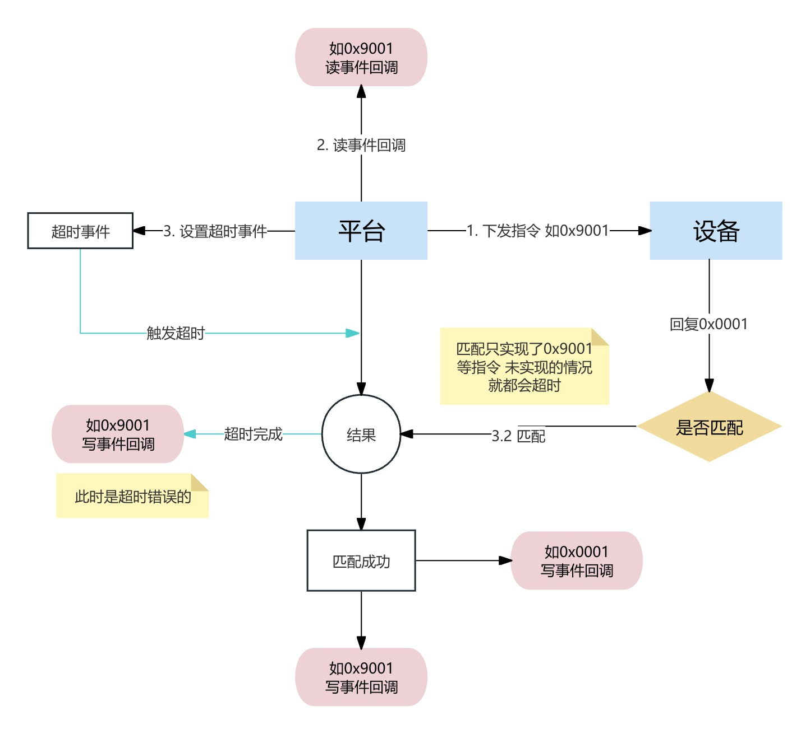

# 协议解析

<h2 id="register"> 1. 协议解析 </h2>

- [代码参考](./register/main.go)

<details>
        <summary>输出详情</summary>

```
模拟器生成的[7e010000300000000000010001001f006e63643132337777772e3830382e636f6d0000000000000000003736353433323101b2e2413132333435363738797e]
[0100] 消息ID:[256] [终端-注册]
消息体属性对象: {
        [0000000000110000] 消息体属性对象:[48]
        版本号:[JT2013]
        [bit15] [0]
        [bit14] 协议版本标识:[0]
        [bit13] 是否分包:[false]
        [bit10-12] 加密标识:[0] 0-不加密 1-RSA
        [bit0-bit9] 消息体长度:[48]
}
[000000000001] 终端手机号:[1]
[0001] 消息流水号:[1]
数据体对象:{
        终端-注册:[001f006e63643132337777772e3830382e636f6d0000000000000000003736353433323101b2e2413132333435363738]
        [001f] 省域ID:[31]
        [006e] 市县域ID:[110]
        [6364313233] 制造商ID(5):[cd123]
        [7777772e3830382e636f6d000000000000000000] 终端型号(20):[www.808.com]
        [37363534333231] 终端ID(7):[7654321]
        [01] 车牌颜色:[1]
        [b2e2413132333435363738] 车牌号:[测A12345678]
}

```
</details>


<h2 id="custom"> 2. 自定义附加信息 </h2>

- [代码参考](./custom_parse/main.go)

<details>
        <summary>输出详情</summary>

```
加入 [0200] 消息ID:[512] [终端-位置上报]
消息体属性对象: {
        [0000000001111011] 消息体属性对象:[123]
        版本号:[JT2013]
        [bit15] [0]
        [bit14] 协议版本标识:[0]
        [bit13] 是否分包:[false]
        [bit10-12] 加密标识:[0] 0-不加密 1-RSA
        [bit0-bit9] 消息体长度:[123]
}
[012345678901] 终端手机号:[12345678901]
[7fff] 消息流水号:[32767] 12345678901 <nil>
        {
                [01]附加信息ID:1 里程
                [04]附加信息长度:4
                [0000000b]里程:[11]
        }
        {
                [02]附加信息ID:2
                [02]附加信息长度:2
                [0016]油量:[22]
        }
        {
                [03]附加信息ID:3
                [02]附加信息长度:2
                [0021]行驶记录功能获取速度:[33]
        }
        {
                [04]附加信息ID:4
                [02]附加信息长度:2
                [002c]需要人工确认报警事件ID:[44]
        }
        {
                胎压 单位为Pa 2019版本新增
                [05]附加信息ID:5
                [1e]附加信息长度:30
                [37]轮胎0胎压:[55]
                [37]轮胎1胎压:[55]
                [37]轮胎2胎压:[55]
        }
        {
                [06]附加信息ID:6 2019版本新增
                [02]附加信息长度:2
                [0000]车厢温度:[0]
        }
        {
                [11]附加信息ID:17 超速报警 详情见表28
                [01]附加信息长度:1
                [00]位置类型:[0] 0-无特定区域 1-圆形 2-矩形 3-多边形 4-路段
        }
        {
                [12]附加信息ID:18 进出区域/路线报警 详情见表29
                [06]附加信息长度:6
                [4d]位置类型:[77] 1-圆形 2-矩形 3-多边形 4-路线
                [0000004d]区域或路段ID:[77]
                [4d]方向:[77]
        }
        {
                [13]附加信息ID:37 路段行驶时间不足/过长报警 详情见表30
                [07]附加信息长度:7
                [00000058]路段ID:[88]
                [0058]路段行驶时间 单位秒:[88]
                [58]结果:[88]
        }
        {
                [25]附加信息ID:37 扩展车辆信号状态码 详情见表31
                [04]附加信息长度:4
                [00000000000000000000000001100011]扩展车辆信号状态位:[99]
                [bit15-31]保留:[0000000000000000]
                [bit14]离合器状态:[false]
                [bit13]加热器工作:[false]
                [bit12]ABS工作:[false]
                [bit11]缓速器工作:[false]
                [bit10]空挡信号:[false]
                [bit9]空调状态:[false]
                [bit8]喇叭信号:[false]
                [bit7]示廓灯:[false]
                [bit6]雾灯信号:[true]
                [bit5]倒挡信号:[true]
                [bit4]制动信号:[false]
                [bit3]左转向灯信号:[false]
                [bit2]右转向灯信号:[false]
                [bit1]远光灯信号:[true]
                [bit0]近光灯信号:[true]
        }
        {
                [2A]附加信息ID:42 IO状态 详情见表32
                [02]附加信息长度:2
                [0000000000001010]IO状态位:[10]
                [bit2-15]保留:[00000000000010]
                [bit1]休眠状态:[true]
                [bit0]深度休眠状态:[false]
        }
        {
                [2b]附加信息ID:43
                [04]附加信息长度:4
                [00000014]模拟量:[20]
        }
        {
                [30]附加信息ID:48
                [01]附加信息长度:1
                [1e]无线通信网络信号强度:[30]
        }
        {
                [31]附加信息ID:49
                [01]附加信息长度:1
                [28]GNSS定位卫星:[40]
        }
        {
                [33]未知附加信息[51] data=[20]

        }
里程[11] 自定义辅助里程[100]
自定义未知信息扩展 32 32

```

</details>

<h2 id="active_reply"> 3. 查询终端参数 </h2>

- [代码参考](./active_reply/main.go)

<details>
        <summary>输出详情</summary>

```
0x8104发送 7e810400000144199999990003437e
数据体对象:{
        [0003] 应答消息流水号:[3]
        [5b] 应答参数个数:[91]
        终端-查询参数:

        {
                [0001]终端参数ID:1 终端心跳发送间隔,单位为秒(s)
                参数长度[4] 是否存在[true]
                [0000000a]参数值:[10]
        }
        {
                [0002]终端参数ID:2 TCP消息应答超时时间,单位为秒(s)
                参数长度[4] 是否存在[true]
                [0000003c]参数值:[60]
        }
        {
                [0003]终端参数ID:3 TCP消息重传次数
                参数长度[4] 是否存在[true]
                [00000002]参数值:[2]
        }
        {
                [0004]终端参数ID:4 UDP消息应答超时时间,单位为秒(s)
                参数长度[4] 是否存在[true]
                [0000003c]参数值:[60]
        }
        {
                [0005]终端参数ID:5 UDP消息重传次数
                参数长度[4] 是否存在[true]
                [00000002]参数值:[2]
        }
        {
                [0006]终端参数ID:6 SMS消息应答超时时间,单位为秒(s)
                参数长度[4] 是否存在[true]
                [0000003c]参数值:[60]
        }
        {
                [0007]终端参数ID:7 SMS消息重传次数
                参数长度[4] 是否存在[true]
                [00000002]参数值:[2]
        }
        {
                [0010]终端参数ID:16 主服务器APN,无线通信拨号访问点.若网络制式为CDMA,则该处为PPP拨号号码
                参数长度[11] 是否存在[true]
                [3133303132333435363730]参数值:[13012345670]
        }
        {
                [0011]终端参数ID:17 主服务器无线通信拨号用户名
                参数长度[5] 是否存在[true]
                [3132333435]参数值:[12345]
        }
        {
                [0012]终端参数ID:18 主服务器无线通信拨号密码
                参数长度[5] 是否存在[true]
                [3132333435]参数值:[12345]
        }
        {
                [0013]终端参数ID:19 主服务器地址,IP或域名,以冒号分割主机和端口,多个服务器使用分号分割
                参数长度[14] 是否存在[true]
                [3132372e302e302e313a37303030]参数值:[127.0.0.1:7000]
        }
        {
                [0014]终端参数ID:20 备份服务器APN
                参数长度[5] 是否存在[true]
                [3132333435]参数值:[12345]
        }
        {
                [0015]终端参数ID:21 备份服务器无线通信拨号用户名
                参数长度[5] 是否存在[true]
                [3132333435]参数值:[12345]
        }
        {
                [0016]终端参数ID:22 备份服务器无线通信拨号密码
                参数长度[5] 是否存在[true]
                [3132333435]参数值:[12345]
        }
        {
                [0017]终端参数ID:23 备份服务器地址,IP或域名,以冒号分割主机和端口,多个服务器使用分号分割
                参数长度[5] 是否存在[true]
                [3132333435]参数值:[12345]
        }
        {
                [0018]终端参数ID:24 服务器TCP端口（2013版本)
                参数长度[0] 是否存在[false]
                [00000000]参数值:[0]
        }
        {
                [0019]终端参数ID:25 服务器UDP端口 (2013版本)
                参数长度[0] 是否存在[false]
                [00000000]参数值:[0]
        }
        {
                [001a]终端参数ID:26 道路运输证IC卡认证主服务器IP地址或域名
                参数长度[9] 是否存在[true]
                [3132372e302e302e31]参数值:[127.0.0.1]
        }
        {
                [001b]终端参数ID:27 道路运输证IC卡认证主服务器TCP端口
                参数长度[4] 是否存在[true]
                [00000457]参数值:[1111]
        }
        {
                [001c]终端参数ID:28 路运输证IC卡认证主服务器UDP端口
                参数长度[4] 是否存在[true]
                [00000458]参数值:[1112]
        }
        {
                [001d]终端参数ID:29 道路运输证IC卡认证主服务器IP地址或域名,端口同主服务器
                参数长度[9] 是否存在[true]
                [3132372e302e302e31]参数值:[127.0.0.1]
        }
        {
                [0020]终端参数ID:32 位置汇报策略:0.定时汇报 1.定距汇报 2.定时和定距汇报
                参数长度[4] 是否存在[true]
                [00000000]参数值:[0]
        }
        {
                [0021]终端参数ID:33 位置汇报方案:0.根据ACC状态 1.根据登录状态和ACC状态,先判断登录状态,若登录再根据ACC状态
                参数长度[0] 是否存在[false]
                [00000000]参数值:[0]
        }
        {
                [0022]终端参数ID:34 驾驶员未登录汇报时间间隔,单位为秒(s),值大于0
                参数长度[4] 是否存在[true]
                [00000000]参数值:[0]
        }
        {
                [0023]终端参数ID:35 从服务器APN.该值为空时,终端应使用主服务器相同配置 (2019版本)
                参数长度[1] 是否存在[true]
                [30]参数值:[0]
        }
        {
                [0024]终端参数ID:36 从服务器无线通信拨号用户名。该值为空时,终端应使用主服务器相同配置 (2019版本)
                参数长度[1] 是否存在[true]
                [30]参数值:[0]
        }
        {
                [0025]终端参数ID:37 从服务器无线通信拨号密码.该值为空时,终端应使用主服务器相同配置 (2019版本)
                参数长度[1] 是否存在[true]
                [30]参数值:[0]
        }
        {
                [0026]终端参数ID:38 从服务器备份地址、IP或域名,主机和端口用冒号分割,多个服务器使用分号分割 (2019版本)
                参数长度[1] 是否存在[true]
                [30]参数值:[0]
        }
        {
                [0027]终端参数ID:39 休眠时汇报时间间隔,单位为秒(s),值大于0
                参数长度[4] 是否存在[true]
                [00000000]参数值:[0]
        }
        {
                [0028]终端参数ID:40 紧急报警时汇报时间间隔,单位为秒(s),值大于0
                参数长度[4] 是否存在[true]
                [00000000]参数值:[0]
        }
        {
                [0029]终端参数ID:41 缺省时间汇报间隔,单位为秒(s),值大于0
                参数长度[4] 是否存在[true]
                [00000000]参数值:[0]
        }
        {
                [002C]终端参数ID:44 缺省距离汇报间隔,单位为米(m),值大于0
                参数长度[4] 是否存在[true]
                [000003e8]参数值:[1000]
        }
        {
                [002D]终端参数ID:45 驾驶员未登录汇报距离间隔,单位为米(m),值大于0
                参数长度[4] 是否存在[true]
                [000003e8]参数值:[1000]
        }
        {
                [002E]终端参数ID:46 休眠时汇报距离间隔,单位为米(m),值大于0
                参数长度[4] 是否存在[true]
                [000003e8]参数值:[1000]
        }
        {
                [002F]终端参数ID:47 紧急报警时汇报距离间隔,单位为米(m),值大于0
                参数长度[4] 是否存在[true]
                [000003e8]参数值:[1000]
        }
        {
                [0030]终端参数ID:48 拐点补传角度,值小于180度
                参数长度[4] 是否存在[true]
                [0000000a]参数值:[10]
        }
        {
                [0031]终端参数ID:49 电子围栏半径(非法位移阈值),单位为米(m)
                参数长度[2] 是否存在[true]
                [003c]参数值:[60]
        }
        {
                [0032]终端参数ID:50 违规行驶时段范围,精确到分。(2019版本)
                参数长度[4] 是否存在[true]
                [16320a1e]参数值:[[22 50 10 30]]
        }
        {
                [0040]终端参数ID:64 监控平台电话号码
                参数长度[11] 是否存在[true]
                [3133303132333435363731]参数值:[13012345671]
        }
        {
                [0041]终端参数ID:65 复位电话号码,可采用此电话号码拨打终端电话让终端复位
                参数长度[11] 是否存在[true]
                [3133303132333435363732]参数值:[13012345672]
        }
        {
                [0042]终端参数ID:65 恢复出厂设置电话号码,可采用此电话号码拨打终端电话让终端恢复出厂设置
                参数长度[11] 是否存在[true]
                [3133303132333435363733]参数值:[13012345673]
        }
        {
                [0043]终端参数ID:66 监控平台SMS电话号码
                参数长度[11] 是否存在[true]
                [3133303132333435363734]参数值:[13012345674]
        }
        {
                [0044]终端参数ID:67 接收终端SMS文本报警号码
                参数长度[11] 是否存在[true]
                [3133303132333435363735]参数值:[13012345675]
        }
        {
                [0045]终端参数ID:69 终端电话接听策略,0-自动接听 1-ACC ON时自动接听,OFF时手动接听
                参数长度[4] 是否存在[true]
                [00000001]参数值:[1]
        }
        {
                [0046]终端参数ID:70 每次最长通话时间,单位为秒(s),0为不允许通话,0xFFFFFFFF为不限制
                参数长度[4] 是否存在[true]
                [00000000]参数值:[0]
        }
        {
                [0047]终端参数ID:71 当月最长通话时间,单位为秒(s),0为不允许通话,0xFFFFFFFF为不限制
                参数长度[4] 是否存在[true]
                [00000000]参数值:[0]
        }
        {
                [0048]终端参数ID:72 监听电话号码
                参数长度[11] 是否存在[true]
                [3133303132333435363738]参数值:[13012345678]
        }
        {
                [0049]终端参数ID:73 监管平台特权短信号码
                参数长度[11] 是否存在[true]
                [3133303132333435363739]参数值:[13012345679]
        }
        {
                [0050]终端参数ID:80 报警屏蔽字.与位置信息汇报消息中的报警标志相对应,相应位为1则相应报警被屏蔽
                参数长度[4] 是否存在[true]
                [00000000]参数值:[0]
        }
        {
                [0051]终端参数ID:81 报警发送文本SMS开关,与位置信息汇报消息中的报警标志相对应,相应位为1则相应报警时发送文本SMS
                参数长度[4] 是否存在[true]
                [00000000]参数值:[0]
        }
        {
                [0052]终端参数ID:82 报警拍摄开关,与位置信息汇报消息中的报警标志相对应,相应位为1则相应报警时摄像头拍摄
                参数长度[4] 是否存在[true]
                [00000000]参数值:[0]
        }
        {
                [0053]终端参数ID:83 报警拍摄存储标志,与位置信息汇报消息中的报警标志相对应,相应位为1则对相应报警时牌的照片进行存储,否则实时长传
                参数长度[4] 是否存在[true]
                [00000000]参数值:[0]
        }
        {
                [0054]终端参数ID:84 关键标志,与位置信息汇报消息中的报警标志相对应,相应位为1则对相应报警为关键报警
                参数长度[4] 是否存在[true]
                [00000000]参数值:[0]
        }
        {
                [0055]终端参数ID:85 最高速度,单位为千米每小时(km/h)
                参数长度[4] 是否存在[true]
                [0000003c]参数值:[60]
        }
        {
                [0056]终端参数ID:86 超速持续时间,单位为秒(s)
                参数长度[4] 是否存在[true]
                [00000014]参数值:[20]
        }
        {
                [0057]终端参数ID:87 连续驾驶时间门限,单位为秒(s)
                参数长度[4] 是否存在[true]
                [00003840]参数值:[14400]
        }
        {
                [0058]终端参数ID:88 当天累计驾驶时间门限,单位为秒(s)
                参数长度[4] 是否存在[true]
                [00000708]参数值:[1800]
        }
        {
                [0059]终端参数ID:89 最小休息时间,单位为秒(s)
                参数长度[4] 是否存在[true]
                [00001c20]参数值:[7200]
        }
        {
                [005a]终端参数ID:90 最长停车时间,单位为秒(s)
                参数长度[4] 是否存在[true]
                [0000012c]参数值:[300]
        }
        {
                [005b]终端参数ID:91 超速预警差值,单位1/10千米每小时(1/10 km/h)
                参数长度[2] 是否存在[true]
                [00000050]参数值:[80]
        }
        {
                [005c]终端参数ID:92 疲劳驾驶预警插值,单位为秒(s),值大于0
                参数长度[2] 是否存在[true]
                [0005]参数值:[5]
        }
        {
                [005d]终端参数ID:93 碰撞报警参数设置 b7-b0: 为碰撞时间,单位为毫秒(ms) b15-18 为碰撞加速度,单位为0.1g;设置范围0-79,默认10
                参数长度[2] 是否存在[true]
                [000a]参数值:[10]
        }
        {
                [005e]终端参数ID:94 侧翻报警参数设置:侧翻角度,单位为度,默认为30度
                参数长度[2] 是否存在[true]
                [001e]参数值:[30]
        }
        {
                [0064]终端参数ID:100 定时拍照参数,参数项格式和定义见表14
                参数长度[4] 是否存在[true]
                [00000001]参数值:[1]
        }
        {
                [0065]终端参数ID:101 定距拍照参数,参数项格式和定义见表15
                参数长度[4] 是否存在[true]
                [00000001]参数值:[1]
        }
        {
                [0070]终端参数ID:112 图像/视频质量,设置范围为1-10,1表示最优质量
                参数长度[4] 是否存在[true]
                [00000001]参数值:[1]
        }
        {
                [0071]终端参数ID:113 亮度,设置范围为0-255
                参数长度[4] 是否存在[true]
                [0000006f]参数值:[111]
        }
        {
                [0072]终端参数ID:114 对比度,设置范围为0-127
                参数长度[4] 是否存在[true]
                [00000070]参数值:[112]
        }
        {
                [0073]终端参数ID:115 饱和度,设置范围为0-127
                参数长度[4] 是否存在[true]
                [00000071]参数值:[113]
        }
        {
                [0074]终端参数ID:116 色度,设置范围为0-255
                参数长度[4] 是否存在[true]
                [00000072]参数值:[114]
        }
        {
                [0080]终端参数ID:128 车辆里程表读数,单位:1/10km
                参数长度[4] 是否存在[true]
                [00000024]参数值:[36]
        }
        {
                [0081]终端参数ID:129 车辆所在的省域ID
                参数长度[2] 是否存在[true]
                [000b]参数值:[11]
        }
        {
                [0082]终端参数ID:130 车辆所在的市域ID
                参数长度[2] 是否存在[true]
                [0066]参数值:[102]
        }
        {
                [0083]终端参数ID:131 公安交通管理部门颁发的机动车号牌
                参数长度[8] 是否存在[true]
                [e4baac415830303031]参数值:[京AX0001]
        }
        {
                [0084]终端参数ID:132 车牌颜色,值按照JT/T 797.7-2014中的规定,未上牌车辆填0
                参数长度[1] 是否存在[true]
                [01]参数值:[1]
        }
        {
                [0090]终端参数ID:144 GNSS定位模式 bit0: 0-禁用GPS定位,1-启用 GPS 定位;...
                参数长度[1] 是否存在[true]
                [02]参数值:[2]
        }
        {
                [0091]终端参数ID:144 GNSS波特率,定义如下: 0x00:4800;...
                参数长度[1] 是否存在[true]
                [01]参数值:[1]
        }
        {
                [0092]终端参数ID:146 GNSS模块详细定位数据输出频率,定义如下:0x01:1000ms(默认值);...
                参数长度[1] 是否存在[true]
                [01]参数值:[1]
        }
        {
                [0093]终端参数ID:147 GNSS模块详细定位数据采集频率,单位为秒(s),默认为 1。
                参数长度[1] 是否存在[true]
                [00000001]参数值:[1]
        }
        {
                [0094]终端参数ID:148 GNSS模块详细定位数据上传方式 0x00,本地存储,不上传(默认值);...
                参数长度[1] 是否存在[true]
                [00]参数值:[0]
        }
        {
                [0095]终端参数ID:149 GNSS模块详细定位数据上传设置, 关联0x0094 上传方式为 0x01 时,单位为秒;...
                参数长度[4] 是否存在[true]
                [00000001]参数值:[1]
        }
        {
                [0100]终端参数ID:256 CAN总线通道1采集时间间隔(ms),0表示不采集
                参数长度[4] 是否存在[true]
                [00000064]参数值:[100]
        }
        {
                [0101]终端参数ID:257 CAN总线通道1上传时间间隔(s),0表示不上传
                参数长度[2] 是否存在[true]
                [00001388]参数值:[5000]
        }
        {
                [0102]终端参数ID:258 CAN总线通道2采集时间间隔(ms),0表示不采集
                参数长度[4] 是否存在[true]
                [00000064]参数值:[100]
        }
        {
                [0103]终端参数ID:259 CAN总线通道2上传时间间隔(s),0表示不上传
                参数长度[2] 是否存在[true]
                [1388]参数值:[5000]
        }
        {
                [0110]终端参数ID:272 CAN总线ID单独采集设置:
                参数长度[8] 是否存在[true]
                [0000000000000101]参数值:[[0 0 0 0 0 0 1 1]]
        }
        未知终端参数id:[33 117 118 119 121 122 123 124]

}


```
</details>

<h2 id="camera"> 4. 立即拍摄例子 </h2>

- [代码参考](./camera/main.go)
- 关闭分包过滤 观察进度

<details>
        <summary>输出详情</summary>

```
# 需要用模拟器或者真实设备来连接
./camera -address=0.0.0.0:8089 -phone=1256256927

```

输出详情 [代码参考](./camera/main.go)
``` txt
监听的地址: 0.0.0.0:8089 测试用的手机号: 1256256927
加入 1256256927 <nil> 7e0102000a00125625692761cc31323536323536393237867e
开始录像 数据体对象:{
        平台-摄像头立即拍照命令:[01ffff000000010aff646464]
        [01] 通道ID:[1]
        [ffff] 拍摄命令:[65535] 0-表示停止拍摄 0xFFFF-表示录像 其它表示拍照张数
        [0000] 拍照间隔/录像时间:[0] 单位秒0表示按最小间隔拍照或一直录像
        [00] 保存标志:[0]  1-保存 0-实时上传
        [01] 分辨率:[1] 0x01-320*240 0x02-640*480 0x03-800*600 0x04-1024*768
        [0a] 图像/视频质量:[10] 1-10 1-代表质量损失最小 10-表示压缩比最大
        [ff] 亮度:[255] 0-255
        [64] 对比度:[100] 0-127
        [64] 饱和度:[100] 0-127
        [64] 色度:[100] 0-255
}
平台主动下发的 3 7e8801000c001256256927000301ffff000000010aff646464387e
完成回复的 25039 20 终端-通用应答
录像的回复 7e0001000500125625692761cf00038801000f7e
开始循环拍照 数据体对象:{
        平台-摄像头立即拍照命令:[010003000100010aff646464]
        [01] 通道ID:[1]
        [0003] 拍摄命令:[3] 0-表示停止拍摄 0xFFFF-表示录像 其它表示拍照张数
        [0001] 拍照间隔/录像时间:[1] 单位秒0表示按最小间隔拍照或一直录像
        [00] 保存标志:[0]  1-保存 0-实时上传
        [01] 分辨率:[1] 0x01-320*240 0x02-640*480 0x03-800*600 0x04-1024*768
        [0a] 图像/视频质量:[10] 1-10 1-代表质量损失最小 10-表示压缩比最大
        [ff] 亮度:[255] 0-255
        [64] 对比度:[100] 0-127
        [64] 饱和度:[100] 0-127
        [64] 色度:[100] 0-255
}
平台主动下发的 4 7e8801000c0012562569270004010003000100010aff6464643d7e
完成回复的 25040 20 终端-通用应答
拍照的回复 7e0001000500125625692761d000048801ffe87e
停止录像 数据体对象:{
        平台-摄像头立即拍照命令:[010000000000010aff646464]
        [01] 通道ID:[1]
        [0000] 拍摄命令:[0] 0-表示停止拍摄 0xFFFF-表示录像 其它表示拍照张数
        [0000] 拍照间隔/录像时间:[0] 单位秒0表示按最小间隔拍照或一直录像
        [00] 保存标志:[0]  1-保存 0-实时上传
        [01] 分辨率:[1] 0x01-320*240 0x02-640*480 0x03-800*600 0x04-1024*768
        [0a] 图像/视频质量:[10] 1-10 1-代表质量损失最小 10-表示压缩比最大
        [ff] 亮度:[255] 0-255
        [64] 对比度:[100] 0-127
        [64] 饱和度:[100] 0-127
        [64] 色度:[100] 0-255
}
平台主动下发的 10 7e8801000c001256256927000a010000000000010aff646464317e
完成回复的 25046 20 终端-通用应答
停止录像的回复 7e0001000500125625692761d6000a8801001f7e
包开始 数据体对象:{
        [00000265] 多媒体数据ID:[613]
        [02] 多媒体数据类型:[2] 0-图像 1-音频 2-视频
        [04] 多媒体格式编码:[4] 0-jpeg 1-tlf 2-mp3 4-wav 4-wmv
        [00] 事件项编码:[0] 0-平台下发指令 1-定时动作 2-抢劫报警触发 3-碰撞侧翻报警触发
        [01] 通道ID:[1]
        [00000000] 报警标志:[0]
        [000c0001] 状态标志:[786433]
        [000e] 海拔高度:[14]
        [0000] 速度:[0]
        [0000] 方向:[0]
        [241121135217] 时间:[2024-11-21 13:52:17]
        多媒体包大小:[964]
}
包完成 ./1256256927_613.wmv 104.7875ms 数据体对象:{
        [00000265] 多媒体数据ID:[613]
        [02] 多媒体数据类型:[2] 0-图像 1-音频 2-视频
        [04] 多媒体格式编码:[4] 0-jpeg 1-tlf 2-mp3 4-wav 4-wmv
        [00] 事件项编码:[0] 0-平台下发指令 1-定时动作 2-抢劫报警触发 3-碰撞侧翻报警触发
        [01] 通道ID:[1]
        [00000000] 报警标志:[0]
        [000c0001] 状态标志:[786433]
        [000e] 海拔高度:[14]
        [0000] 速度:[0]
        [0000] 方向:[0]
        [241121135217] 时间:[2024-11-21 13:52:17]
        多媒体包大小:[428520]
}

```
</details>

<h2 id="custom_command"> 5. 自定义指令处理 </h2>

- [代码参考](./custom_command/main.go)

```
如终端上传0x0200位置信息 -> 设备回复0x8001通用应答
1. 解析jt808固定报文头 获取指令id
2.1 如果指令id不存在 如0x1111 则触发OnNotSupportedEvent（不支持的指令回调)
2.2 指令id存在 如0x0200 则触发OnReadExecutionEvent （读事件回调)
3.1 如果指令不需要回复则结束
3.2 如果指令需要回复 如0x0200 -> 0x8001 则触发OnWriteExecutionEvent (写事件回调)
```



```
如平台下发0x9001请求实时音视频 -> 设备回复0x0001通用应答
1. 发送0x9001指令后 触发OnReadExecutionEvent （读事件回调)
2.1 如果超时的情况 则触发OnWriteExecutionEvent (写事件回调)
2.2 如果匹配完成的情况
触发0x0001指令的OnWriteExecutionEvent (写事件回调)
在触发0x9001指令的OnWriteExecutionEvent (写事件回调)
```

